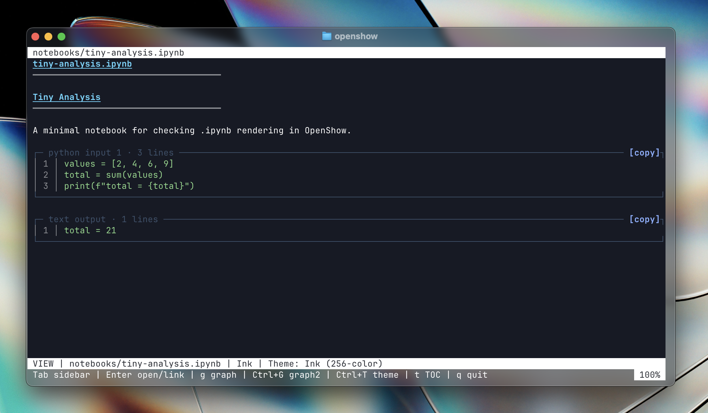
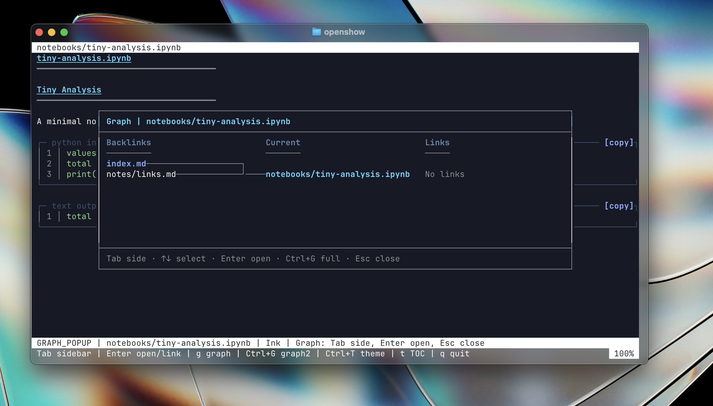
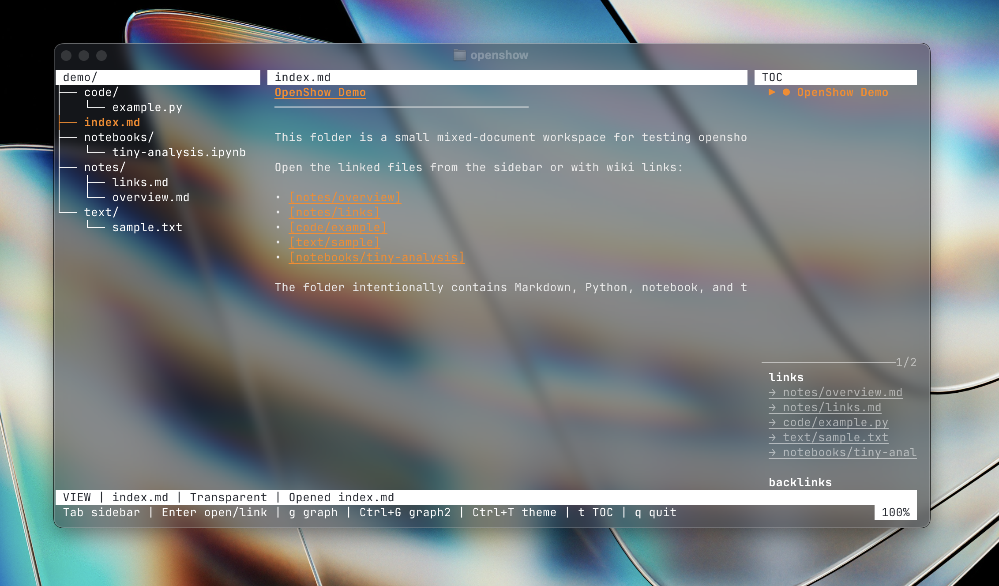

# OpenShow

OpenShow is a terminal document viewer for browsing Markdown vaults, text files, code files, and notebooks with wiki links, backlinks, themes, live refresh, editing, and graph navigation.

It is designed for small Markdown knowledge bases and Obsidian-style folders, while staying lightweight enough to run as a small Python curses package.

## Preview


<table>
<tr>
<td></td>
<td></td>
</tr>
<tr>
<td></td>
<td></td>
</tr>
</table>

## Features

- Browse a Markdown vault or a general document directory with a tree-style sidebar
- Open individual Markdown, text, code, and `.ipynb` files directly
- Render Markdown headings, lists, tables, blockquotes, code blocks, and frontmatter
- Follow Obsidian-style wiki links such as `[[note]]`, `[[note#Heading]]`, and `[[note|Label]]`
- View page links, backlinks, and a table of contents
- Search across documents
- Edit Markdown, text, and code files in the terminal
- Auto-refresh when supported documents are changed externally
- Switch themes from an in-app tab selector
- Use one-level and two-level graph views centered on the current document
- Install as a terminal command named `openshow`

## Requirements

- Python 3.10 or newer
- A terminal with curses support
- Optional: Node.js and npm, if you want npm-based installation

On Windows, use WSL or another terminal environment with Python curses support.

## Install

### npm

From this repository:

```bash
npm install -g .
```

Then run:

```bash
openshow
```

The npm package is a thin wrapper around the Python app. It avoids Python package installation issues on Debian/Ubuntu systems with externally managed Python environments.

### pipx

```bash
pipx install -e .
openshow
```

### Python editable install

Use this inside a virtual environment:

```bash
python3 -m venv .venv
. .venv/bin/activate
python -m pip install -e .
openshow
```

### Development without install

```bash
python3 -m openshow database
```

## Usage

Open the current directory:

```bash
openshow
```

Open the bundled mixed-document demo:

```bash
openshow demo
```

Open another Markdown vault:

```bash
openshow /path/to/your/vault
```

Open a single file directly:

```bash
openshow README.md
openshow notes.txt
openshow app.py
openshow analysis.ipynb
```

Start with a specific theme:

```bash
openshow database --theme graphite
openshow database --theme transparent
openshow database --theme ink
```

The default theme is `transparent`.

## Keyboard Shortcuts

| Key | Action |
|-----|--------|
| `Tab` | Toggle the sidebar, or open the navigation popup on narrow terminals |
| `Up` / `Down` or `k` / `j` | Move through the active list or scroll the viewer |
| `Enter` | Open the selected note, expand/collapse a folder, follow a link, or activate a popup item |
| `Ctrl+E` | Enter edit mode, or return from edit mode |
| `Ctrl+S` | Save while editing |
| `Esc` | Cancel edit mode, clear search, or close popups |
| `Ctrl+F` | Search across notes |
| `n` | Jump to the next search result |
| `t` | Toggle the table of contents |
| `Ctrl+T` | Open the theme selector tabs |
| `g` | Open the one-level graph popup |
| `Ctrl+G` | Open the two-level graph viewer |
| `q` | Quit from viewer mode |

Mouse support is available for opening notes, following visible wiki links, scrolling panes, and selecting popup items.

## Markdown Links

OpenShow supports common Obsidian-style wiki links:

```markdown
[[python-basics]]
[[data-structures#Hash Table]]
[[projects/todo-app|Todo App]]
```

Links are resolved by note stem or relative path. For example, `[[python-basics]]` resolves to `python-basics.md`.

## Graph Views

OpenShow includes two graph views centered on the current note.

### One-Level Graph

Press `g` to open a centered popup showing:

```text
Backlinks -> Current -> Links
```

Use `Tab` or the arrow keys to switch sides, `Up` / `Down` to select a note, and `Enter` to open it.

### Two-Level Graph

Press `Ctrl+G` to use the full viewer area for a two-level graph:

```text
upstream sources -> backlinks -> current note -> links -> downstream notes
```

This mode is useful for seeing how a note is connected to its immediate context. If the graph is taller than the terminal, it scrolls automatically to keep the selected item visible.

The bundled vault includes `database/demo_project/graph-center.md` as a purpose-built graph demo.
The `demo/` folder is a smaller mixed-document workspace with Markdown, Python, notebook, and plain text files.

## Live Refresh

OpenShow checks the opened directory or file for external changes once per second. The check is intentionally lightweight: it only compares each supported document's relative path, modification timestamp, and file size.

When a change is detected, OpenShow reloads the document set, refreshes the sidebar, updates links and backlinks, and re-renders the current document if it still exists.

Live refresh is paused while editing inside OpenShow to avoid disrupting unsaved changes.

## Themes

Available themes:

- `transparent` - default terminal background with white text and orange accents
- `graphite` - dark graphite background with white text and orange accents
- `ink` - dark blue background with cool accent colors

Open the theme selector with `Ctrl+T`.

## Demo Vault

The `database/` directory contains an English sample vault with:

- Programming notes
- Project notes
- Concept notes
- Refactoring and CLI design notes
- A dedicated graph viewer demo project
- A long note for live refresh testing

Run it with:

```bash
openshow demo
```

## Packaging

This repository supports both npm and Python packaging:

- `package.json` exposes `openshow` through `bin/openshow.js`
- `pyproject.toml` exposes `openshow = openshow.cli:main`

The Python application is split across the `openshow/` package so document loading, search, terminal helpers, themes, and CLI startup can be tested and maintained independently.

## Tests

Run the test suite:

```bash
python3 -m pytest
```

Run a syntax check:

```bash
python3 -m compileall openshow
```

## License

No license has been selected yet. Add a license before publishing this project for public reuse.
